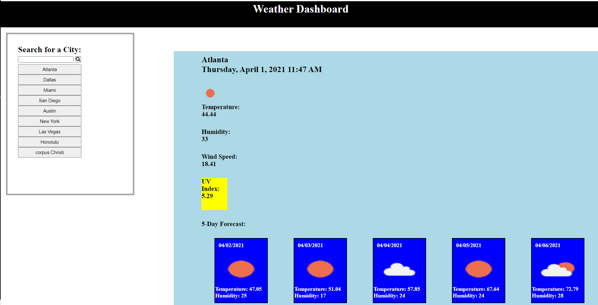

# Weather Dashboard Project

## Description

For this project I created a weather dashboard that displays the date, temperature, humidity, wind speed and uv index for any searched city. The uv index also changes color based on the severity of the index that day. When a city is searched a button is populated and storage in a list of previously searched city that one can click to more easily access the weather information for that city. Finally a 5 day forecast displays the temp and humidity for the next 5 days in each city.

Deployed Link:
https://zreggert.github.io/weather_forecast/

